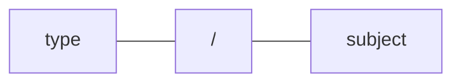
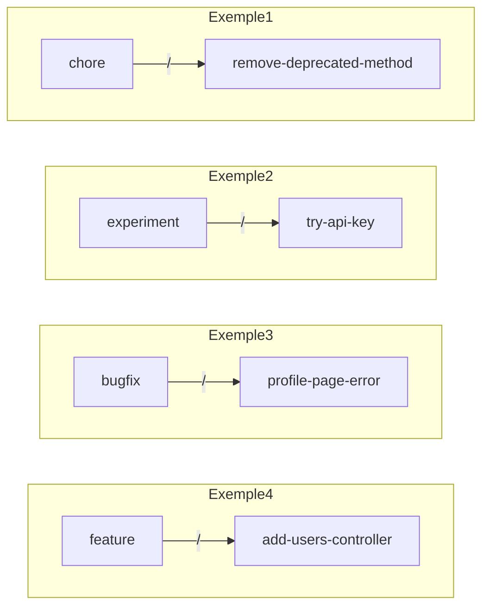
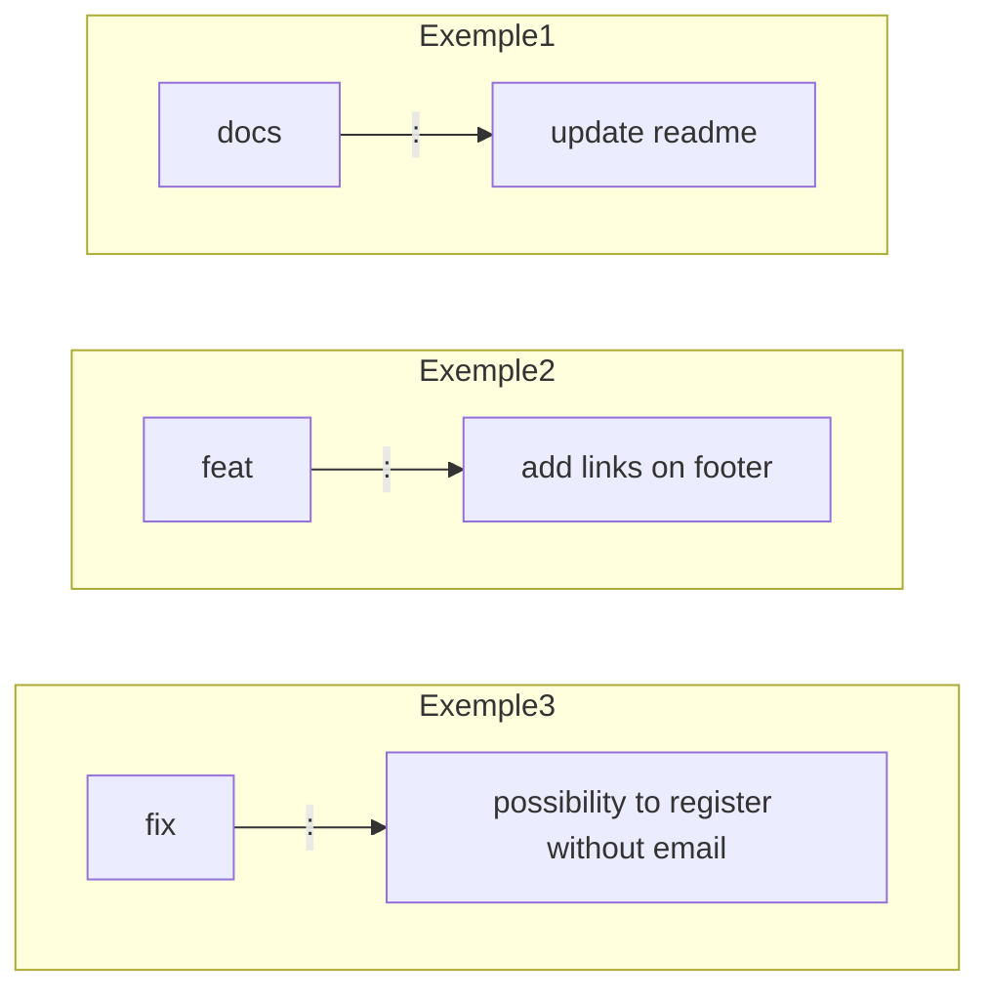

# Comment nommer ses branches et ses commits ?

## Nommer les branches 🌿

Le format du nom de la branches est le suivant :

En premier lieu le ‘type’ suivis d'un slash puis le ‘subject’.

### Les types de branches

-   **setup**: Initialisation des fichiers et dossier de bases (sans modifications);
-   **feature**: Ajout d’une nouvelle fonctionnalité;
-   **style**: Ajout de style (front);
-   **bugfix**: Correction d’un bug;
-   **chore**: Nettoyage du code;
-   **refactor**: Modification n’ajoutant pas de fonctionnalités ni de correction de bug.
-   **spelling**: Correction de fautes d'orthographes ou modification de textes.
    
### Le nom de la branche

Le nom de la branche décrit succinctement le but de celle-ci. Certaines règles doivent être respectées :

-   Le nom doit faire moins de 50 caractères;
-   Le nom doit respecter la convention kebab-case (les mots doivent être en minuscule et liés par des tirets “-“);
  
**﹥Quelques exemples**

## Nommer les messages de commits 💬

### Format des commits

Le format du commits est le suivant :
    

En premier lieu le ‘type’ suivis de deux points, un espace et pour finir le ‘subject’.

#### Le type

Le type du commit décrit l’origine du changement. Il peut prendre différentes valeurs :

-   **init**: Ajout de fichiers et dossiers basiques(amorce d’un projet);
-   **feat**: Ajout d’une nouvelle fonctionnalité;
-   **fix**: Correction d’un bug;
-   **build**: Changement lié au système de build ou qui concerne les dépendances (npm, grunt, gulp, webpack, etc.).
-   **docs**: Ajout ou modification de documentation (README, JSdoc, etc.);
-   **refactor**: Modification n’ajoutant pas de fonctionnalités ni de correction de bug (renommage d’une variable, suppression de code redondant, simplification du code, etc.);
-   **style**: Changement lié au style du code (indentation, point virgule, etc.);
-   **test**: Ajout ou modification de tests;
-   **revert**: Annulation d’un précédent commit;
-   **ci**: Ajout ou modification de la configuration des fichiers et/ou script du CI
-   **perf**: Mise à jour du code dans le but d'optimiser les performances
-   **test**: Mise en place, edition, suppression de tests

#### Le sujet

Le sujet décrit succinctement la modification. Certaines règles doivent être respectées :

-   Le sujet doit faire moins de 50 caractères;
-   Les verbes doivent être à l’impératif (add, update, change, remove, etc.);
-   Aucunes majuscules
-   Le sujet ne doit pas se terminer par un point.
     
**﹥Quelques exemples**     

